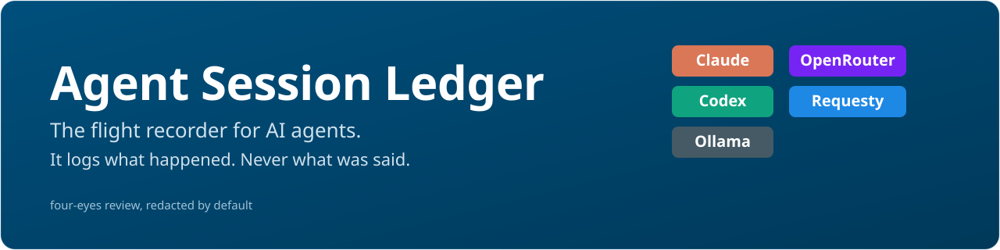
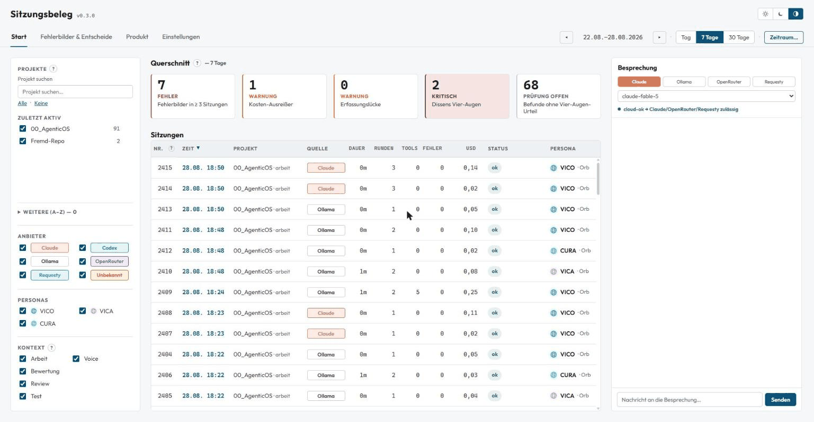
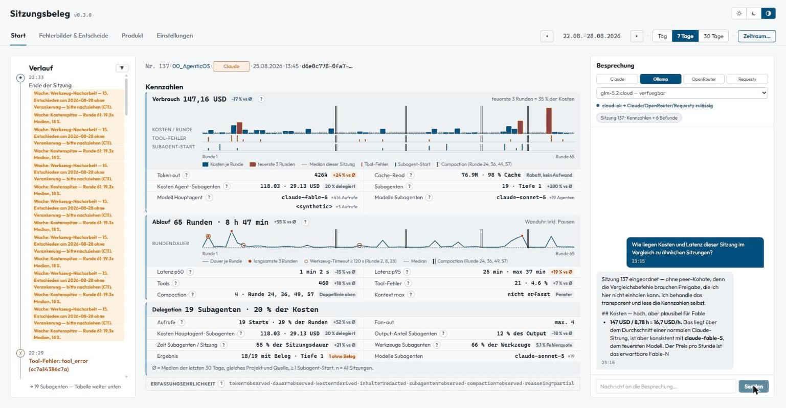
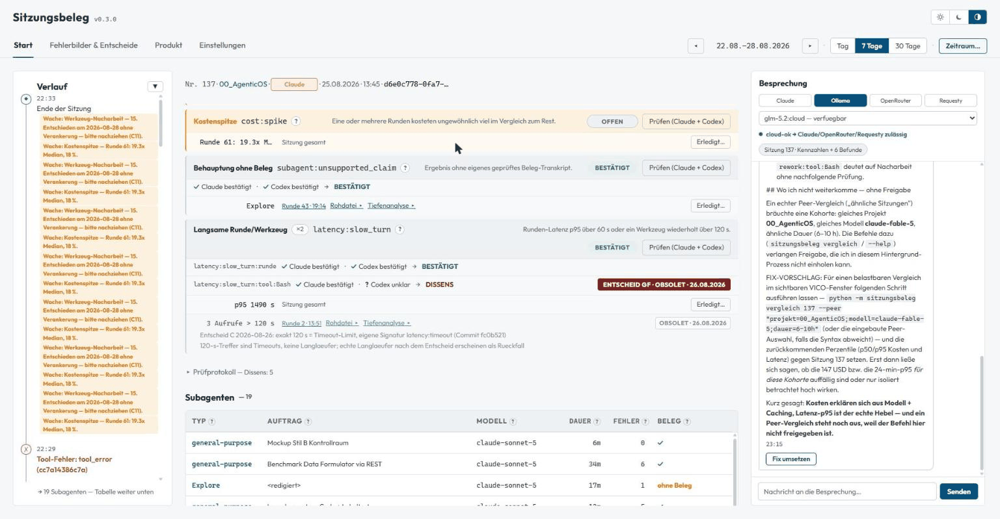
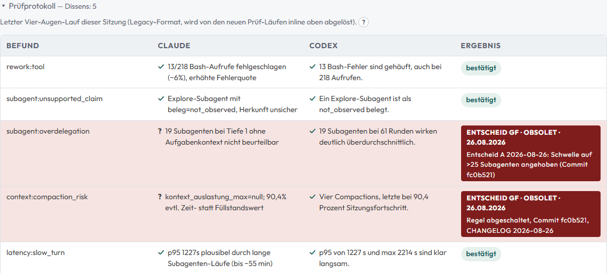
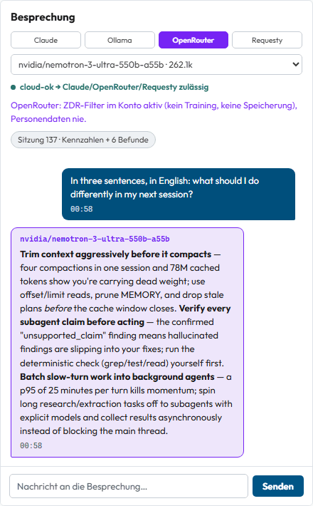
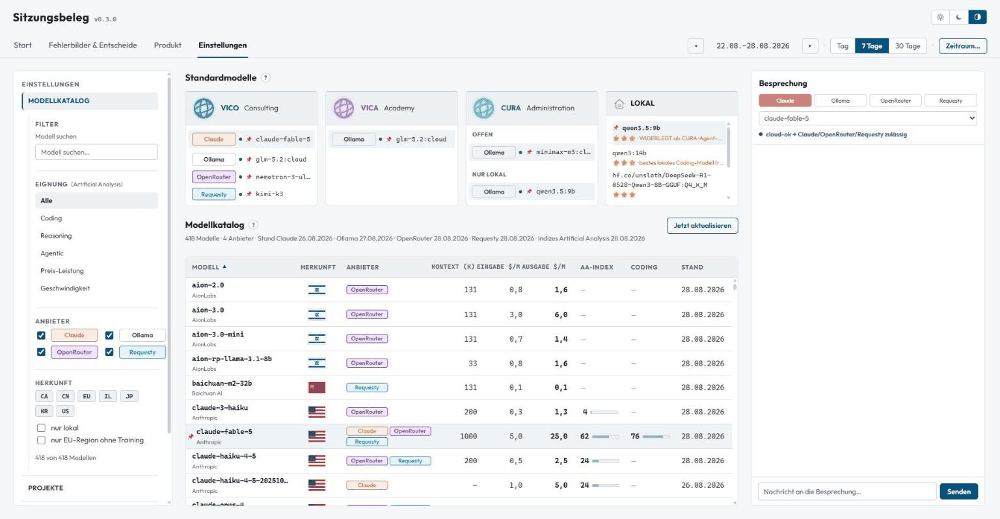

# Agent Session Ledger

[](https://github.com/jm-vis/agent-session-ledger/actions/workflows/tests.yml)

The flight recorder for AI agents: every Claude Code and Codex session becomes a ledger
record with numbers and rule IDs, never content. MIT licensed, Python, 1,000+ tests.

In the UI you will see the German product name **Sitzungsbeleg** ("session receipt").
Same thing: the repo speaks English, the dashboard speaks German.

## What it is

`sitzungsbeleg` reads a session transcript from disk and turns it into a deterministic
ledger record. What goes in:

- **Numbers**: duration, token counts, tool calls and latencies, delegation to subagents, cost.
- **Rule IDs**: findings such as `latency:slow_turn` or `cost:spike`, each a short ID plus
  a small structured detail.

What never goes in: prompts, reasoning, tool arguments, tool output. The parser drops
content at the source, not at the edge, and a redaction gate checks every value again
before it is written.

Around that record:

- **Append-only Postgres.** The ingest role inserts, the dashboard reads, nothing deletes silently.
- **Four-eyes review.** Every finding gets an independent verdict from Claude and from
  Codex, blind to each other. Agreement closes it, disagreement goes to a human.
- **A read-only dashboard** with cross-session cost and latency outliers.
- **A chat column** that discusses a session's numbers (never the transcript) with the
  model of your choice: Claude, local Ollama, OpenRouter, or Requesty.
- **A model catalog** that consolidates every model reachable through those four providers
  into one sortable table: prices, context windows, origin flags, benchmark indices.

## Screenshots

### The session list



One row per session: source, duration, turns, tool calls, errors, cost, status, persona.
On top the cross-session alerts (`FEHLER` = recurring error patterns, `KRITISCH` =
unresolved four-eyes disagreement, `PRUEFUNG OFFEN` = findings awaiting a verdict).

### One session in detail



Cost per round, round duration, and delegation, each plotted against the rolling median
of comparable sessions, so an outlier is visible at a glance. The bottom line
(`ERFASSUNGSEHRLICHKEIT`, capture honesty) states what was observed, what was derived,
and what the ledger never saw.

### Findings



Each finding carries its rule ID and a status pill (`OFFEN` = open, `BESTAETIGT` =
confirmed, `DISSENS` = models disagreed).

### The four-eyes protocol



The core of the review: Claude's verdict and Codex's verdict side by side, neither saw
the other. Two checkmarks close a finding. A question mark sends it to a human, and the
human decision is stamped on the row with a date (`ENTSCHEID Maintainer`). No model decides alone.

### The chat column



Discuss a session with the model of your choice, four providers one click apart. The
conversation starts with the session's redacted numbers and findings in context; the
model name is printed on every answer.

### The model catalog



Every model reachable through the four providers, consolidated into one row per actual
model: origin flags, cheapest price per provider, Artificial Analysis intelligence and
coding indices. Filters for suitability, provider, origin, local-only, and
EU-region-without-training.

## How it works

1. **Ingest**: a reader (`leser_claude.py` / `leser_codex.py`) walks a transcript file and
   extracts only types, timestamps, counts, and short references. No message text, no tool
   arguments, no tool output ever enters the in-memory record.
2. **Redaction allow list**: every field of the record passes through `redaktion.py`
   before it can be stored or rendered. Anything that looks like a path, a secret, an email
   address, or exceeds 80 characters is stripped or the whole record is rejected. See
   `SECURITY.md` for the one documented exception.
3. **Postgres**: a clean record is written append-only (`speicher.py`, via `psql`, no
   ORM, no driver). The role that ingests can only INSERT/SELECT.
4. **Rules**: `regeln.py` and `querschnitt.py` check the record against a small,
   versioned rule set (cost outliers, slow rounds, tool rework loops, cross-session
   repeats), producing findings, not verdicts.
5. **Four eyes**: `vieraugen.py` sends the compact record (never the transcript) to an
   isolated Claude process and an isolated Codex process, each in an empty working
   directory with no project context. Agreement closes a finding; disagreement is flagged.
6. **Dashboard**: `web.py` serves a read-only FastAPI app (`static/`) showing sessions,
   findings, and cross-session trends, plus the optional chat column described above.

## Install

Requires Python 3.12 and Postgres 16.

```bash
pip install -r requirements.txt

# Postgres via Docker (adjust .env first, copied from .env.example)
cp .env.example .env
docker compose up -d

# Apply migrations in order (each is idempotent)
export PGPASSWORD=<your PG_SUPER_PASSWORD>
for f in sql/0001_ereignis.sql sql/0002_herkunft.sql sql/0003_sitzung.sql \
         sql/0004_sitzung_logisch.sql sql/0005_chat.sql; do
    docker exec -i sitzungsbeleg-postgres psql -U postgres -d ereignis \
        -v app_pw='<a new password for the app role>' -v ON_ERROR_STOP=1 -f - < "$f"
done

# Ingest whatever Claude Code / Codex transcripts you already have locally
python -m sitzungsbeleg ingest-dir --db --seit 30

# Dashboard on http://127.0.0.1:8091/
python -m sitzungsbeleg serve
```

Run `python -m sitzungsbeleg --help` for the full command list (`ingest`, `ingest-dir`,
`report`, `review`, `reingest-sql`, `serve`, `aliase`, `entscheid`). Two optional Windows
Task Scheduler helpers are included (`sitzungsbeleg/Register-IngestTask.ps1`,
`sitzungsbeleg/Register-DashboardTask.ps1`) if you want ingest and the dashboard to run on
login instead of by hand.

`speicher.py` talks to Postgres through `docker exec` against a container named
`sitzungsbeleg-postgres` by default (the included `docker-compose.yml` uses that name).
Set `SITZUNGSBELEG_PG_CONTAINER` if your container has a different name.

## Configuration

Everything is read from the environment (or a `.env` file next to `modelle.json`, see
`.env.example`). Beyond the Postgres credentials in `.env.example`:

| Variable | Default | Purpose |
| --- | --- | --- |
| `SITZUNGSBELEG_MODELLE` | `modelle.json` in the folder above the package, else the copy inside the package | Path to the model catalog data file |
| `SITZUNGSBELEG_PG_CONTAINER` | `sitzungsbeleg-postgres` | Docker container name used for `docker exec ... psql` |
| `SITZUNGSBELEG_WORK_DIR` | `_work/` (gitignored) | Folder for generated standardisation notes |
| `SITZUNGSBELEG_FIX_LAUNCHER` | unset | Optional argv (JSON list, `{handover}` placeholder) for the chat column's "apply fix" button. Unset -> the endpoint returns 501 and the button shows "not configured" |
| `ARTIFICIALANALYSIS_API_KEY` | unset | Optional key for the model catalog's intelligence/coding/agentic indices |

### Persona axis

Sessions carry an optional persona attribute: one of three profile slots, `vico`
(default), `vica`, or `cura`. The active slot is derived automatically from the suffix of
the `CLAUDE_CONFIG_DIR` environment variable's directory name (ending in `.vica` ->
`vica`, ending in `.cura` -> `cura`, anything else -> `vico`). This only labels which
local Claude Code profile a session ran under, for per-profile filtering in the
dashboard; it carries no built-in company or role meaning.

## What it does not do / Known gaps

- **No retention or delete command yet.** Records are append-only; there is currently no
  CLI command to purge old rows from Postgres. Because the record never held content in the
  first place, this is a smaller gap than it would be for a tool that stores transcripts,
  but it is still open.
- **The chat column is the one deliberate egress.** It sends a session's redacted numbers
  (never the transcript) plus your own message to a provider you choose per message. API
  keys live in an environment file outside the repository; never commit one. The
  OpenRouter path prefers the account's zero-data-retention (ZDR) setting where available.
- **Single-machine by default.** The dashboard binds to `127.0.0.1` only; there is no
  built-in multi-user auth. Put a reverse proxy in front if you need remote access.

## Origin

This project was rebuilt after reviewing
[bar-observatory](https://github.com/bar181/bar-observatory) for a "take a tool and make
it usable at work" community challenge. The original has no crate source in its own
repository, so there was nothing to patch. We read it, wrote down every concern, and
built our own tool from that review upward rather than forking.

**What we kept:** the capture-honesty pattern (mark absence explicitly instead of a silent
0/empty), the determinism contract (a report is a pure function of the stored record, no
model in the render path), and zero egress by default on the primary path.

**What we dropped:** everything that is not core to a single, auditable session ledger --
a local HTTP proxy in front of the model API, a built-in OpenTelemetry receiver, raw
unrestricted SQL access to the capture database, a bespoke "AI-to-AI" specification
language, an always-on LLM interpretation layer, and a multi-channel fleet-cost ledger.
Fewer features means a smaller surface to audit, which was the point of the exercise.

## Language note

The user interface and the code comments are German (this project grew out of a German
workflow); the interface contracts (`CONTRACTS.md`) and this README are English so the
project is reviewable regardless of which language you read code comments in.

## License

MIT, see [LICENSE](LICENSE).
